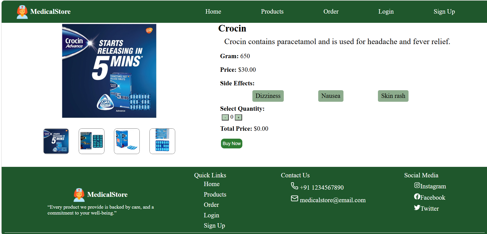

# 🏥 MedicalStore Web Application

## 📌 Project Overview

**MedicalStore** is a React-based web application that simulates an online medical store. Users can browse medicines, view details, add products to cart, and place orders easily.

---

## 🚀 Features

### 🏠 Home Page

* Attractive landing page

* Displays medicines using **Product Cards**

* Each product card includes:

  * Image
  * Name
  * Description
  * Price
  * **Add to Cart Button** 🧺
  * **Know More Button**

* Users can directly add medicines to cart from the home page

---

### 💊 Products Page

* Displays all available medicines
* Product cards with:

  * Image
  * Description
  * Price
  * "Know More" button

---

### 📄 Product Details Page

* Detailed information about selected medicine
* Includes:

  * Image
  * Full description
  * Price
  * Buy option

---

### 🧺 Cart Functionality

* Users can add products to cart using **Add to Cart button**
* If the same product is added multiple times:

  * Quantity increases automatically
* Cart stores selected items before ordering

---

### 🛒 Order Page

* Opens after clicking **Buy Button**
* Displays:

  * Product Name
  * Quantity
  * Price
  * Delivery Charges
  * Total Amount

---

### 🔐 Authentication

* Login Page
* Signup Page

---

### 📦 UI Components

* Header (Navigation bar)
* Footer (Contact & Information)
* Reusable Product Cards

---

## 🛠️ Technologies Used

* React JS
* JavaScript (ES6)
* HTML5
* CSS3

---

## ⚙️ Installation & Setup

```bash
git clone https://github.com/your-username/medicalstore.git
cd medicalstore
npm install
npm run dev
```

---

## 📸 Screens Included

### 🏠 Home Page


### ProductCardDetails Page

---

## 🎯 Future Enhancements

* Full Cart Page UI
* Payment Gateway Integration
* Search & Filter medicines
* Order History
* Admin Dashboard

---

## 👩‍💻 Team Members

**Vaishnavi Pawar**\
**Anushka Kakade**\
**Supriya Walhekar**

---

## 📄 License

This project is for educational purposes only.
